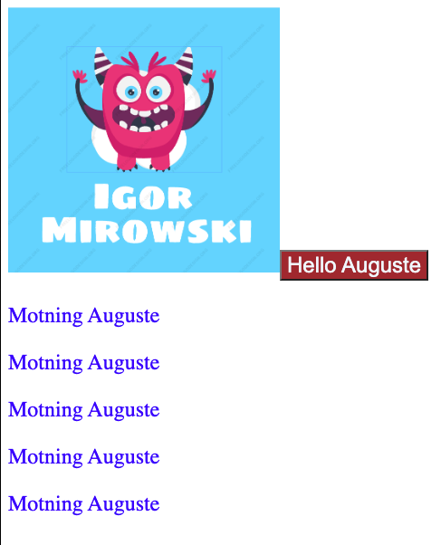

# LAP3--webpack
WEBPACK:
- merge code into one bundle

STEPS:
- `npm innit -y`
- `npm install webpack webpack-cli --save-dev`
- `webpack (or npx webpack)` (#dist folder appear)
- `touch webpack.config.js`

3 MODES: 
- development 
- production 
- none

## Adding logo /CSS 
- Loaders - to process the file
- TO INSTALL:
    - `npm i -D file-loader`
    - update webpack.config.js
    - [rubular](https://rubular.com/)
    
- INSTALL CSS loader:
    - `npm install css-loader --save-dev`
    - `add  { test: /\.css$/, use: 'css-loader' } to webpac.condig.js`

    - `npm i style-loader --save-dev`
    -  ` add { test: /\.css$/, use: ['style-loader', 'css-loader'] }` ORDER IMPORTANT!

### BALEL LOADER: (allows to deal with class properties)
- `npm i @babel/core babel-loader @babel/preset-env @babel/plugin-proposal-class-properties --save-dev`
- add rules to webpack.config.js

- - [babel](https://babeljs.io/)

### Playing with Plugins

- `npm install terser-webpack-plugin --save-dev`
- add require in webpack.config.js + add plugins

- `npm i -D mini-css-extract-plugin` (we can check in package.json)
- webpack.config.js: Require and add plugin
- (replace style-loader with new `MiniCssExtractPlugin.loader`) --> WE LOST STYLE IN HTML --> add in html ` <link rel="stylesheet" href="./public/auguste.css">`

- cache ISSUES :
   ` plugins: [
      new TerserPlugin(),
      new MiniCssExtractPlugin({
          filename: 'auguste.[contenthash].css'
      })  ` 

Every time I make change I want a new CSS file

To solve issues with multiple CSS:
- `npm i -D html-webpack-plugin`

### Adding favicon  (2 ways)
- 1st from index.html
- 2nd add within plugins in webpack.config.js

## USE 2 Modes (dev and prod)
- `mv config/webpack.config{prod,.prod}.js` (changes name of file by adding dot to be compatible)
- copy from webpack.config.js ( remember to rename mode from none)
- Install webpack dev server `npm i -D webpack-dev-server `
